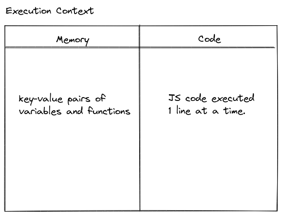

## How JavaScript works?

- JavaScript is a synchronous single threaded language. Only executes 1 command at a time in a specific order. Next line is executed once the current line has been executed.
- Everything in JavaScript happens inside an execution context.
- Execution context is like a big box with 2 components:-  
    1. Memory component or Variable environment - Variables and functions are stored as key-value pairs.
    2. Code component or Thread of Execution - Place where JS code is executed 1 line at a time.

        

- Execution context is created in 2 phases:-  
    1. Memory Allocation Phase - Memory is allocated to all variables and functions. key as variable name and value as undefined in case of variables and key as function name and value as code of the function in case of functions.
    2. Code Execution Phase - Value of variables is allocated in memory and code is executed in code component. In case of function invocations a new execution context is created. This new execution context is deleted after the function returns and its execution is complete. Global execution context is also deleted when the code execution is complete.

- Call Stack (execution context stack/program stack/control stack/runtime stack/machine stack) maintains the order of execution of execution contexts.
    1. Global execution context is pushed to call stack when any JS program is run.
    2. When a new execution context is created on function invocation it is pushed to call stack and popped out after execution is complete.
    3. Call stack is empty when execution of all JS code is complete.

- Hoisting
    1. Process where compiler allocates memory for variable and function declarations before the execution of the code.
    2. Declarations made using `let` and `const` are not initialized as part of hoisting. Until the line in which they are initialized is executed, any code that accesses these variables will throw an exception.