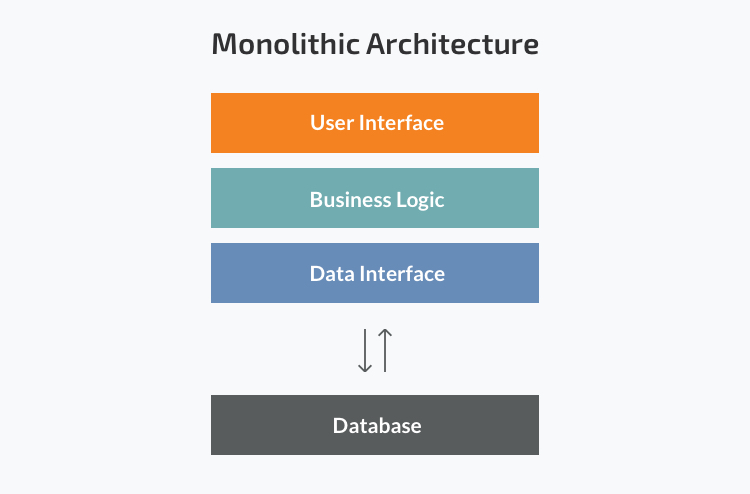
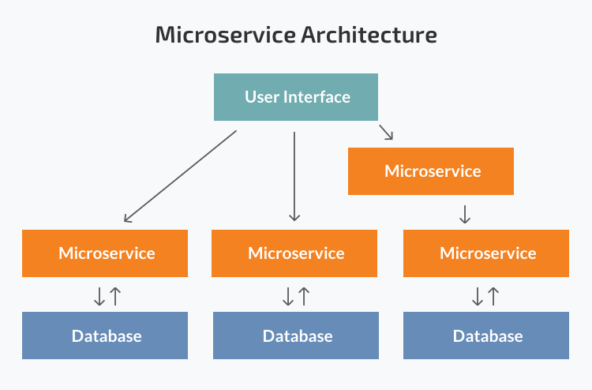

## Monolithic Architecture

- Traditional way of building applications.
- Application is built as a single and indivisible unit.
- Client-side UI + Server-side application + Database
- One large codebase (lack modularity).

### Advantages

- Caching, logging and performance monitoring is easier to handle.
- Easier debugging and testing as it is a single unit.
- Easy deployment (one file or directory).
- Easy to develop.

### Disadvantages

- Single point of failure even if horizontally scaled because same entire system is deployed on various machines.
- Hard to manage a complex system of code within one application (while scaling).
- Hard to implement changes in a large and complex application with tight coupling. Any code change affects the whole system so it has to be thoroughly coordinated.
- Cannot scale components independently, only the whole application.
- Cannot apply a new technology in a monolithic application because the entire application has to be rewritten.

## Microservices Architecture

- Collection of smaller independent units.
- Units carry out every application process as a separate service.
- All services have their own logic and database and perform specific functions.
- Each service can be updated, deployed and scaled independently.

### Advantages

- Independent components make it easy to fix bugs and add new features.
- Easier understanding as it is split up into smaller and simpler components.
- Better scalability as each element can be scaled independently. In monolithic the entire application has to be scaled even if there is no need of it.
- Flexibility in choosing the technology for each microservice.
- Faults affect only a particular service and not the whole solution.

### Disadvantages

- Extra Complexity - A microservices architecture is a distributed system so we have to choose and set up the connections between all the modules and databases. All independent services have to be deployed independently.
- Testing independently deployable components is harder.

## When Monolithic?

- Small team
- Simple application (do not demand much business logic, scalability and flexibility)
- Quick launch and no Microservices expertise

## When Microservices?

- Complex and scalable application
- Microservices expertise
